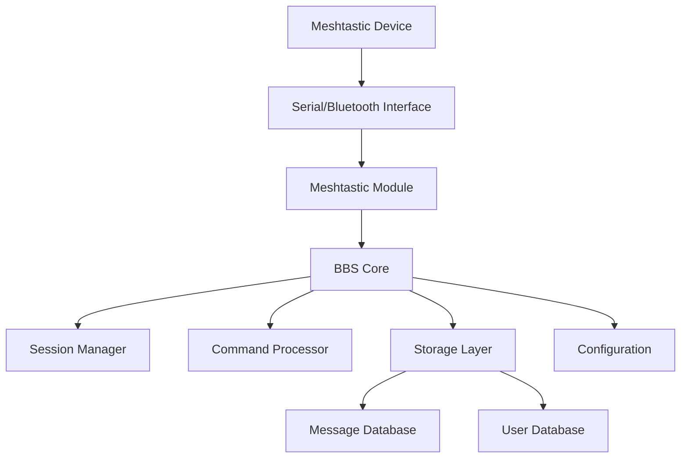

<div align="center">
  
  
  # MeshBBS
  
  **A modern Bulletin Board System for Meshtastic mesh networks**
  
  [](https://github.com/martinbogo/meshbbs/releases)
  [](LICENSE)
  [](https://www.rust-lang.org/)
  [](https://meshtastic.org/)
  
  *Bringing the classic BBS experience to modern mesh networks*
  
  [🚀 Quick Start](#quick-start) • [📖 User Guide](#usage) • [📚 Documentation](docs/) • [🔧 API Reference](https://martinbogo.github.io/meshbbs/meshbbs/) • [🤝 Contributing](#contributing) • [💬 Support](#support)
</div>

---

## 🌟 Overview

MeshBBS revolutionizes communication on mesh networks by bringing the beloved Bulletin Board System experience to Meshtastic devices. Exchange messages, participate in forums, and build communities over long-range, low-power radio networks—all without traditional internet infrastructure.

Perfect for emergency communications, remote areas, outdoor adventures, and building resilient community networks.

## 📚 Documentation

Comprehensive documentation is available in the [`docs/`](docs/) directory and hosted at [GitHub Pages](https://martinbogo.github.io/meshbbs):

- **[Installation Guide](docs/getting-started/installation.md)** - Complete setup instructions
- **[Command Reference](docs/user-guide/commands.md)** - All available commands and usage
- **[API Documentation](https://martinbogo.github.io/meshbbs/meshbbs/)** - Generated Rust API docs
- **[Administration Guide](docs/administration/)** - BBS setup and management
- **[Hardware Compatibility](docs/hardware/)** - Supported devices and setup

> The documentation is maintained alongside the code and automatically updated with each release.

## ✨ Features

### � **Connectivity & Integration**
- **📡 Meshtastic Integration**: Direct communication via serial or Bluetooth
- **🛎️ Public Discovery + DM Sessions**: Low-noise public channel handshake leading to authenticated Direct Message sessions
- **⚡ Async Design**: Built with Tokio for high performance

### 💬 **Communication & Messaging**
- **📚 Message Boards**: Traditional BBS-style message areas and forums
- **🎯 Dynamic Contextual Prompts**: Smart prompts showing current state (`unauth>`, `user@area>`, `post@area>`)
- **📜 Enhanced Help System**: Compact `HELP` + verbose `HELP+` with detailed command reference
- **📏 Optimized Message Size**: 230-byte limit optimized for Meshtastic constraints

### 👥 **User Management & Security**
- **🔐 Robust Security**: Argon2id password hashing with configurable parameters
- **👑 Role-Based Access**: User, Moderator, and Sysop roles with granular permissions
- **🛂 Per-Area Access Levels**: Config-driven read/post level gating
- **💡 Smart User Experience**: One-time shortcuts reminder, streamlined login flow

### 🛠️ **Administration & Moderation**
- **🧷 Persistent Area Locks**: Moderators can LOCK/UNLOCK areas; state survives restarts
- **📊 Deletion Audit Log**: `DELLOG` command for accountability tracking
- **📈 Network Statistics**: Usage and performance monitoring
- **🌤️ Proactive Weather Updates**: Automatic 5-minute weather refresh

## 🚀 Quick Start

> **Prerequisites**: Rust 1.82+, Meshtastic device, USB cable or Bluetooth connection

### 📦 Installation

```bash
# Clone the repository
git clone --recurse-submodules https://github.com/martinbogo/meshbbs.git
cd meshbbs

# Build the project
cargo build --release

# Initialize the BBS configuration
./target/release/meshbbs init
```

### ⚙️ Configure Your BBS

After initialization, edit the `config.toml` file to set up your BBS:

```bash
# Open config.toml in your preferred editor
nano config.toml  # or vim, code, etc.
```

**Critical settings to configure:**

1. **📡 Meshtastic Connection** - Update your serial port:
   ```toml
   [meshtastic]
   port = "/dev/ttyUSB0"  # Change to your device port
   # macOS: often /dev/tty.usbserial-*
   # Windows: often COM3, COM4, etc.
   # Linux: often /dev/ttyUSB0, /dev/ttyACM0
   ```

2. **👑 Sysop Information** - Set your admin details:
   ```toml
   [bbs]
   name = "Your BBS Name"
   sysop = "Your Name"  # This becomes your admin username
   location = "Your Location"
   zipcode = "12345"    # For weather features
   ```

3. **🔐 Set Sysop Password** - Secure your admin account:
   ```bash
   ./target/release/meshbbs sysop-passwd
   ```

### 🚀 Start Your BBS

```bash
# Start the BBS server (use your configured port)
./target/release/meshbbs start

# Or specify port if different from config
./target/release/meshbbs start --port /dev/ttyUSB0
```

### ⚡ Quick Commands

| Command | Description |
|---------|-------------|
| `meshbbs init` | Create initial configuration file |
| `meshbbs sysop-passwd` | Set/update sysop password (do this first!) |
| `meshbbs start` | Start BBS server with config.toml settings |
| `meshbbs start --port /dev/ttyUSB0` | Override port from command line |
| `meshbbs status` | Show server statistics and status |

## ⚙️ Configuration

MeshBBS uses a `config.toml` file for all settings. Run `meshbbs init` to create a default configuration.

<details>
<summary><strong>📋 View Example Configuration</strong></summary>

```toml
[bbs]
name = "MeshBBS Station"
sysop = "Your Name"
location = "Your Location" 
zipcode = "97210"
description = "A bulletin board system for mesh networks"
max_users = 100             # Hard cap on concurrent logged-in sessions
session_timeout = 10        # Minutes of inactivity before auto-logout
welcome_message = "Welcome to MeshBBS! Type HELP for commands."

[meshtastic]
port = "/dev/ttyUSB0"
baud_rate = 115200
node_id = ""
channel = 0

[storage]
data_dir = "./data"
max_message_size = 230        # Protocol hard cap
message_retention_days = 30
max_messages_per_area = 1000

[message_areas.general]
name = "General Discussion"
description = "General chat and discussion"
read_level = 0    # Minimum user level to read
post_level = 0    # Minimum user level to post

[logging]
level = "info"
file = "meshbbs.log"
```
</details>

### 🎛️ Key Configuration Options

| Section | Purpose | Key Settings |
|---------|---------|--------------|
| `[bbs]` | Basic BBS settings | `name`, `sysop`, `max_users`, `session_timeout` |
| `[meshtastic]` | Device connection | `port`, `baud_rate`, `channel` |
| `[storage]` | Data management | `max_message_size`, `retention_days` |
| `[message_areas.*]` | Forum areas | `read_level`, `post_level` |

## 📖 Usage

### 🎮 Command Line Interface

```bash
# Start the BBS server
meshbbs start --port /dev/ttyUSB0

# Initialize configuration  
meshbbs init

# Show status and statistics
meshbbs status

# Run serial smoke test
meshbbs smoke-test

# Set/update sysop password
meshbbs sysop-passwd

# Enable verbose logging
meshbbs -vv start
```

### 📡 Connecting via Meshtastic

MeshBBS uses a **two-step interaction model** that keeps the shared mesh channel quiet while enabling rich private sessions.

#### 🔍 **Step 1: Say Hello on the Public Channel**
Commands require `^` prefix to address the BBS:
- `^HELP` - Returns onboarding message
- `^LOGIN <username>` - Registers pending login for your node ID

#### 💬 **Step 2: Start Your Private Conversation**
After public `LOGIN`, open a private message to the BBS node to start your authenticated session.

<details>
<summary><strong>📋 Complete Command Reference</strong></summary>

**Authentication Commands:**
```bash
LOGIN <user> [pass]       # Authenticate (set password if first time)
REGISTER <user> <pass>    # Create new account
LOGOUT                    # End session
CHPASS <old> <new>        # Change password
SETPASS <new>             # Set initial password (passwordless accounts)
```

**Navigation & Help:**
```bash
HELP / H / ?              # Compact help with shortcuts
HELP+ / HELP V            # Detailed verbose help with examples
M                         # Quick navigation to message areas
U                         # Quick navigation to user menu
Q                         # Quit/logout
B                         # Back to previous menu
```

**Message Commands:**
```bash
AREAS / LIST              # List available message areas
READ <area>               # Read recent messages from area
POST <area> <message>     # Post a message to area
POST <area>               # Start multi-line post (end with '.' on new line)
```

**Moderator Commands** (level ≥5):
```bash
DELETE <area> <id>        # Remove a message
LOCK <area>               # Prevent new posts
UNLOCK <area>             # Allow posts again  
DELLOG [page]             # View deletion audit entries
```

**Sysop Commands** (level 10):
```bash
PROMOTE <user>            # Promote user level
DEMOTE <user>             # Demote user level
```
</details>

### 🎯 Dynamic Prompts

MeshBBS shows contextual prompts that reflect your current state:

| Prompt | Meaning |
|--------|---------|
| `unauth>` | Not logged in |
| `alice (lvl1)>` | Logged in as alice, user level 1 |
| `alice@general>` | Reading messages in 'general' area |
| `post@general>` | Posting a message to 'general' area |

### 📏 Message Size Limit

Each message is limited to **230 bytes** (not characters) to mirror Meshtastic text payload constraints. Multi-byte UTF-8 characters reduce visible character count. Oversized posts are rejected with an error.

## 🏗️ Architecture

MeshBBS is built with a clean, modular architecture in Rust:



### 📁 Module Structure

- **`bbs/`**: Core BBS functionality and user interface
- **`meshtastic/`**: Meshtastic device communication layer
  - Parses protobuf frames and emits structured `TextEvent` items
- **`storage/`**: Message and file storage subsystem  
- **`config/`**: Configuration management

## 🛠️ Development

### 🔧 Building from Source

```bash
# Development build
cargo build

# Optimized release build
cargo build --release

# Run comprehensive test suite
cargo test

# Run with debug logging
RUST_LOG=debug cargo run -- start
```

### 🎛️ Feature Flags

Control optional functionality with Cargo features:

| Feature | Default | Description |
|---------|---------|-------------|
| `serial` | ✅ | Serial port communication |
| `meshtastic-proto` | ✅ | Protobuf parsing of Meshtastic packets |
| `weather` | ✅ | Weather lookup via wttr.in |
| `api-reexports` | ✅ | Re-export internal types |

```bash
# Minimal build without optional features
cargo build --no-default-features

# Build with specific features only
cargo build --features "serial,weather"
```

### 📡 Meshtastic Protobuf Integration

For rich packet handling, enable the `meshtastic-proto` feature. Upstream protobuf definitions are included as a git submodule.

<details>
<summary><strong>🔧 Protobuf Setup Instructions</strong></summary>

**Fresh clone with submodules:**
```bash
git clone --recurse-submodules https://github.com/martinbogo/meshbbs.git
```

**Initialize submodules in existing clone:**
```bash
git submodule update --init --recursive
```

**Build with protobuf support:**
```bash
cargo build --features meshtastic-proto
```

**Update submodules:**
```bash
git submodule update --remote third_party/meshtastic-protobufs
git add third_party/meshtastic-protobufs
git commit -m "chore(deps): bump meshtastic protobufs"
```

**Use custom proto directory:**
```bash
MESHTASTIC_PROTO_DIR=path/to/protos cargo build --features meshtastic-proto
```
</details>

### 📂 Project Structure

```
meshbbs/
├── 📄 src/
│   ├── main.rs           # Application entry point
│   ├── lib.rs            # Library exports
│   ├── 🎮 bbs/           # Core BBS functionality
│   │   ├── server.rs     # BBS server implementation
│   │   ├── session.rs    # User session management
│   │   ├── commands.rs   # BBS command processing
│   │   ├── public.rs     # Public channel command parsing
│   │   └── roles.rs      # User role definitions
│   ├── 📡 meshtastic/    # Meshtastic integration
│   ├── 💾 storage/       # Data persistence
│   ├── ⚙️ config/        # Configuration management
│   └── 📋 protobuf/      # Protobuf definitions
├── 🧪 tests/             # Integration tests
├── 📊 data/              # BBS data directory (runtime)
├── 🔧 third_party/       # Git submodules
│   └── meshtastic-protobufs/
└── 📝 config.toml        # Configuration file
```

## 🗺️ Roadmap

### ✅ Recent Releases
- **v0.9.20** (2025-09-23): Version consistency and stability improvements
- **v0.9.18** (2025-09-23): New user welcome system, enhanced security, sysop username support
- **v0.9.0** (2025-09-22): Dynamic prompts, enhanced help system, proactive weather updates

### 🚀 Upcoming Features
- [ ] **📁 File Transfer**: Binary data protocols optimized for mesh constraints
- [ ] **🔐 Enhanced Encryption**: End-to-end message encryption beyond transport security  
- [ ] **🌐 Web Interface**: Optional web-based administration and monitoring
- [ ] **🔗 Federation**: Multi-node BBS networks with message routing
- [ ] **📱 Mobile Clients**: Native mobile apps for easier mesh BBS access

## 💻 Hardware Compatibility

MeshBBS works with all Meshtastic-compatible devices:

| Device Family | Models | Features |
|---------------|--------|----------|
| **T-Beam** | ESP32 + LoRa + GPS | ✅ Full support |
| **Heltec** | LoRa 32 v1/v2/v3 | ✅ Full support |
| **TTGO** | LoRa32 variants | ✅ Full support |
| **LilyGO** | T-Echo, T-Deck, T3S3 | ✅ Full support |
| **RAK WisBlock** | 4631 Core + LoRa | ✅ Full support |
| **Seeed Studio** | WM1302, WM1110 | ✅ Full support |

> All devices supporting Meshtastic firmware are compatible with MeshBBS

## 🤝 Contributing

We welcome contributions from the community! Here's how to get started:

### 🚀 Quick Contribution Guide

1. **🍴 Fork** the repository
2. **🌟 Create** a feature branch: `git checkout -b feature/amazing-feature`
3. **💻 Make** your changes with tests
4. **✅ Test** your changes: `cargo test && cargo clippy`
5. **📝 Commit** with clear messages: `git commit -m 'feat: add amazing feature'`
6. **📤 Push** to your branch: `git push origin feature/amazing-feature`
7. **🔄 Submit** a Pull Request

### 📋 Development Guidelines

- Follow Rust best practices and idioms
- Add tests for new functionality
- Update documentation for user-facing changes
- Run `cargo fmt` and `cargo clippy` before committing
- Keep commits focused and atomic

See [CONTRIBUTING.md](CONTRIBUTING.md) for detailed guidelines.

## 📄 License

<div align="center">

[](https://creativecommons.org/licenses/by-nc/4.0/)

</div>

This project is licensed under the **Creative Commons Attribution-NonCommercial 4.0 International License**.

**You are free to:**
- ✅ **Share** — copy and redistribute in any medium or format
- ✅ **Adapt** — remix, transform, and build upon the material

**Under these terms:**
- 🏷️ **Attribution** — Give appropriate credit and indicate changes
- 🚫 **NonCommercial** — No commercial use without permission

See the [LICENSE](LICENSE) file or visit [CC BY-NC 4.0](https://creativecommons.org/licenses/by-nc/4.0/) for details.

## 🙏 Acknowledgments

Special thanks to the projects and communities that make MeshBBS possible:

- 🌐 **[Meshtastic](https://meshtastic.org/)** - The open source mesh networking project
- ⚡ **[Tokio](https://tokio.rs/)** - Asynchronous runtime for Rust  
- 📻 **Amateur Radio Community** - For mesh networking innovations
- 🦀 **Rust Community** - For the amazing language and ecosystem

## 💬 Support

<div align="center">

**Need help? We're here for you!**

[](mailto:martinbogo@gmail.com)
[](https://github.com/martinbogo/meshbbs/issues)
[](https://martinbogo.github.io/meshbbs)

</div>

### 🐛 Bug Reports
Found a bug? Please [open an issue](https://github.com/martinbogo/meshbbs/issues/new) with:
- Steps to reproduce
- Expected vs actual behavior  
- System information (OS, Rust version, device model)
- Relevant log output

### 💡 Feature Requests
Have an idea? We'd love to hear it! [Start a discussion](https://github.com/martinbogo/meshbbs/discussions) or create an issue.

### 🆘 Getting Help
- Check the [Documentation](docs/) for comprehensive guides
- Browse the [API Reference](https://martinbogo.github.io/meshbbs/meshbbs/) for technical details
- Search existing [Issues](https://github.com/martinbogo/meshbbs/issues) for solutions
- Join the discussion in [GitHub Discussions](https://github.com/martinbogo/meshbbs/discussions)

---

<div align="center">
  
**🎯 MeshBBS - Bringing bulletin board systems to the mesh networking age! 📡**

*Built with ❤️ for the mesh networking community*

[](https://www.rust-lang.org/)
[](https://meshtastic.org/)

</div>